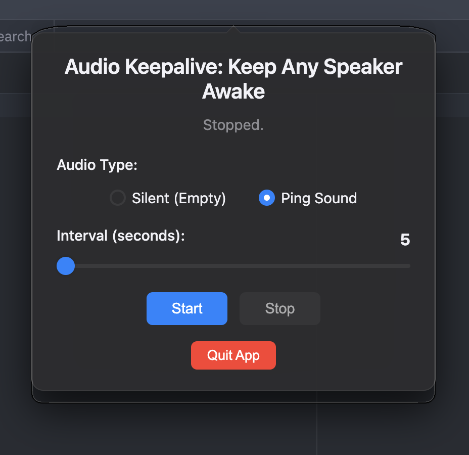

# Speaker Awake

🔊 **Keep Any Speaker Awake** - Electron App

A lightweight macOS tray utility that prevents speakers from going to sleep by playing silent or ping audio at configurable intervals. Perfect for keeping Bluetooth speakers, USB DACs, and audio interfaces active.

## ✨ Features

- 🔇 **Silent or Ping Audio**: Choose between completely silent audio or audible ping sounds
- ⏰ **Configurable Intervals**: Set timing from 5 seconds to 1 hour (in 5-second increments)
- 💾 **Persistent State**: Remembers your settings and continues running after switching apps
- 🎛️ **System Tray Integration**: Lives in your menu bar, stays out of the way
- 🌙 **Dark Mode Support**: Automatically adapts to your system theme
- 📱 **Clean Interface**: Minimal, native macOS-style popup window
- 🚀 **Lightweight**: Minimal resource usage, efficient timer management
- 🔄 **Smart Resume**: Automatically resumes playback when returning to the app

## Perfect For

- **Marshall Speakers** (Action III, Acton, Stanmore, etc.)
- **Bluetooth Speakers** that auto-sleep after inactivity
- **USB DACs** and audio interfaces
- **Studio Monitors** and powered speakers
- Any audio device that causes delays or pops when waking up

## Screenshots



## Installation

### Download Pre-built Binaries

1. Go to the [Releases](https://github.com/yourusername/speaker-awake/releases) page
2. Download the `.dmg` file for macOS
3. Open the DMG and drag the app to your Applications folder
4. Launch and enjoy!

### Build from Source

#### Prerequisites

- Node.js (version 14 or higher)
- npm package manager

#### Clone and Install

```bash
git clone https://github.com/yourusername/speaker-awake.git
cd speaker-awake
npm install
```

## Usage

1. **Launch the app** - it will appear in your system tray (menu bar)
2. **Click the tray icon** to open the control panel
3. **Choose audio type**:
   - **Silent (Empty)**: Completely silent audio to keep speakers awake
   - **Ping Sound**: Audible ping for confirmation that it's working
4. **Set the interval**: Use the slider to choose how often to play audio (5s - 1hr)
5. **Click Start** - the app will begin keeping your speakers awake
6. **Switch apps freely** - your settings and timer persist across app switches

### Pro Tips

- Start with **60-300 second intervals** for most Bluetooth speakers
- Use **Silent mode** for background operation
- Use **Ping mode** when testing or for audible confirmation
- The app remembers your last settings automatically

## Development

### Run in Development

```bash
npm start
```

### Build for Distribution

```bash
npm run build:mac    # Build macOS DMG
npm run build-all    # Build with custom icon
```

### Project Structure

```
speaker-awake/
├── main.js          # Main Electron process with tray integration
├── preload.js       # Secure IPC bridge
├── renderer.js      # UI logic with state persistence
├── index.html       # Main application window
├── styles.css       # Native macOS-style CSS
├── assets/          # Icons and audio files
│   ├── empty.mp3    # Silent audio file
│   ├── ping.mp3     # Ping audio file
│   └── trayIcon.png # System tray icon
└── package.json     # Project configuration
```

## How It Works

The app uses a smart approach to prevent audio device sleep:

1. **Timer Management**: Creates a single, persistent timer that survives app switching
2. **Audio Playback**: Plays very short audio clips at your chosen interval
3. **State Persistence**: Uses localStorage to remember settings and running state
4. **Window Reuse**: Reuses the same window instead of creating new ones
5. **Smart Resume**: Calculates time elapsed while away and adjusts accordingly

## System Requirements

- **macOS**: 10.15 (Catalina) or later
- **Memory**: ~50MB RAM usage
- **Disk**: ~100MB storage space

## Troubleshooting

### Common Issues

**Multiple audio streams playing**
- Fixed in latest version - the app now ensures only one timer runs

**Settings reset when switching apps**
- Fixed in latest version - state persists across app switches

**Dropdown not working**
- Replaced with reliable radio buttons in latest version

**App asks to start again after switching**
- Fixed in latest version - maintains running state

### Audio Issues

- **No audio playing**: Check system volume and audio output device
- **Speakers still sleeping**: Try shorter intervals (15-30 seconds)
- **Pops or clicks**: Switch to silent mode and ensure interval isn't too short

## Technical Details

- **Built with**: Electron 27.x
- **Audio Format**: MP3 files for broad compatibility
- **Timer Precision**: JavaScript setInterval with cleanup protection
- **State Storage**: Browser localStorage with JSON serialization
- **UI Framework**: Native HTML/CSS with system font stack

## Contributing

1. Fork the repository
2. Create a feature branch (`git checkout -b feature/amazing-feature`)
3. Commit your changes (`git commit -m 'Add some amazing feature'`)
4. Push to the branch (`git push origin feature/amazing-feature`)
5. Open a Pull Request

## License

This project is licensed under the MIT License - see the [LICENSE](LICENSE) file for details.

## Changelog

### Latest Version
- ✅ Fixed multiple timer issue
- ✅ Added persistent state across app switches
- ✅ Replaced dropdown with reliable radio buttons
- ✅ Added smart resume functionality
- ✅ Improved window management
- ✅ Enhanced audio selection with silent/ping modes

## Support

Having issues? Here's how to get help:

1. Check the [Issues](https://github.com/yourusername/speaker-awake/issues) page
2. Create a new issue with:
   - Your macOS version
   - Speaker/audio device model
   - Steps to reproduce the problem
   - Screenshots if applicable

## Acknowledgments

- Thanks to the Electron team for the excellent framework
- Inspired by Marshall speaker users experiencing auto-sleep issues
- Built for the audio community who just wants their speakers to work reliably

---

**Made with ❤️ for audio enthusiasts who are tired of speaker sleep issues
