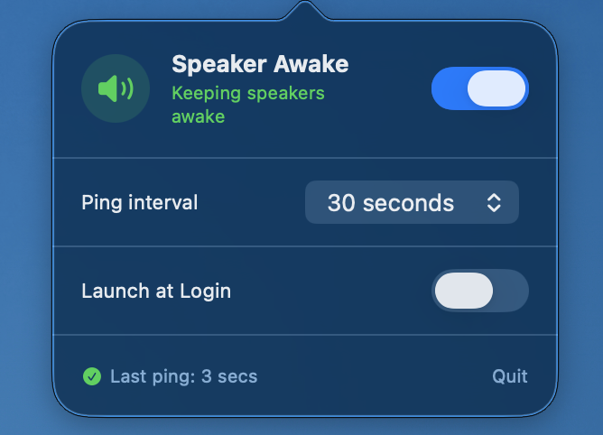
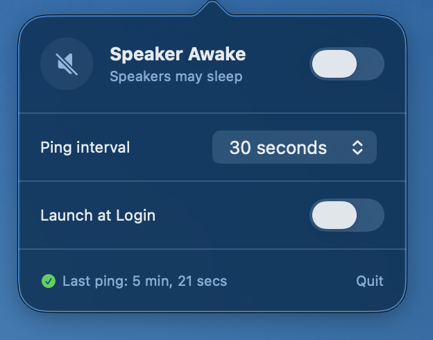

# Speaker Awake

A lightweight macOS menu bar utility that keeps your speakers awake by periodically sending an inaudible audio signal — preventing the hardware sleep delay ("pop") that occurs when audio resumes after silence.

---

## Screenshots

| Active | Inactive |
|:---:|:---:|
|  |  |
| Keeping speakers awake | Speakers may sleep |

**Menu bar icons**

| Active | Inactive |
|:---:|:---:|
|  |  |

---

## Features

- Lives in the macOS menu bar — no Dock icon
- Plays a near-silent 440 Hz tone via AVAudioEngine to keep audio hardware active
- Configurable ping interval: 15 s, 30 s, 1 min, 2 min, 5 min
- On/off toggle with live status indicator
- Launch at Login support
- Persists all settings across launches
- Native Swift + SwiftUI — minimal CPU and memory footprint

## Requirements

| | |
|---|---|
| macOS | 14.0 Sonoma or later |
| Xcode | 15.0 or later |
| Architecture | Apple Silicon (arm64) · Intel (x86_64) |

## Quick Start

```bash
git clone <repo-url>
cd speaker-awake
open SpeakerAwake.xcodeproj
```

Press **⌘R** in Xcode to build and run. The app appears in the menu bar — no Dock icon.

For a full setup guide, build instructions, and DMG packaging see [SETUP.md](SETUP.md).

## How It Works

`AVAudioEngine` runs a `AVAudioPlayerNode` that loops a 4410-sample buffer containing a 440 Hz sine wave at −120 dBFS (completely inaudible). The buffer length is chosen so the sine wave completes exactly 44 full cycles, ensuring a click-free seamless loop.

The audio hardware stays continuously active as long as the engine is running, eliminating the brief silence and amplifier "pop" that occurs when macOS wakes a sleeping audio device.

## Project Structure

```
SpeakerAwake.xcodeproj
SpeakerAwake/
  SpeakerAwakeApp.swift       — @main entry, hides Dock icon
  AppDelegate.swift           — NSApplicationDelegate lifecycle
  StatusBarController.swift   — NSStatusItem + NSPopover management
  AudioKeepAlive.swift        — AVAudioEngine keep-alive logic
  ContentView.swift           — SwiftUI popover UI
  LaunchAtLogin.swift         — SMAppService login item registration
  Info.plist                  — LSUIElement = YES (menu bar only)
  Assets.xcassets/
    AppIcon.appiconset/
    SpeakerOn.imageset/   — menu bar icon (active, template)
    SpeakerOff.imageset/  — menu bar icon (inactive, template)
```

## License

[MIT](LICENSE)
